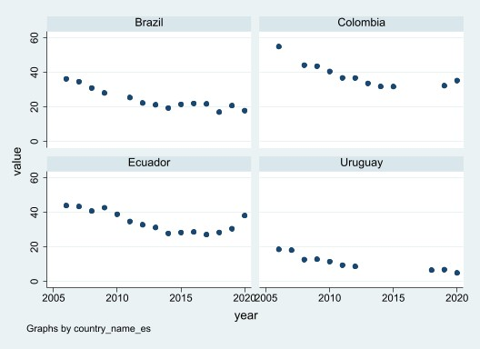
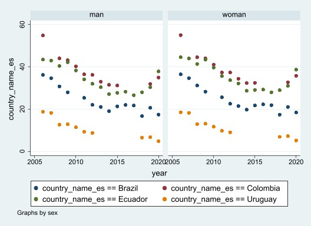

# idbsocialdata: Stata module to access 

## Description

Stata module to access IADB SCLdata collections

### Install

Install the development version:


``` r
net  install idbsocialdata, from("https://raw.githubusercontent.com/BID-DATA/idbsocialdata/main") replace
```


### Parameters

- countries(string): Countries and Regions acronyms (ISOALPHA-3 for countries). 
- indicators(string): Indicators List list of indicator codes (All series).
- categories(string):
- startyear(string):
- endyear(string):

When selecting multiple values please use coma (,) to separate them

## Examples

This is a basic example

``` r
clear

idbsocialdata, indicators("pobreza") countries("COL,ECU,BRA,URY")

twoway (scatter value year), scheme(s2color) by(country_name_es)
```




``` r
clear

idbsocialdata, indicators("pobreza") countries("COL,ECU,BRA,URY") categories("sex")


separate value, by(country_name_es) shortlabel
set scheme s2color
scatter value? year, ytitle(country_name_es) by(sex)

```



## 


## Disclaimer


## Terms of use 


## Blog Posts


## Suggested Citation

## Author: 

  **SCLData**  

