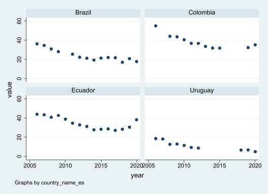
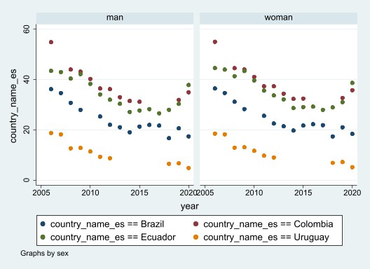

# idbsocialdata: Stata module to access 
Important: This package is in Beta - expect changes and updates

## Description

Stata module to access IADB SCLdata collections

### Install

Install the development version:


``` r
net  install idbsocialdata, from("https://raw.githubusercontent.com/EL-BID/idbsocialdata/main") replace
```

# Data

With this function you can download any indicator from the SCLdata collections. You can browse this [dictionary](https://github.com/EL-BID/idbsocialdataR/blob/main/data/scldata_dict.csv) to see what is available.


### Parameters
- countries(string): Countries and Regions acronyms (ISOALPHA-3 for countries). 
- indicators(string): Indicators List list of indicator codes (All series).
- categories(string):
- startyear(string):
- endyear(string):

When selecting multiple values please use coma (,) to separate them

## Examples

This is a basic example

``` r
clear

idbsocialdata, indicators("pobreza") countries("COL,ECU,BRA,URY")

twoway (scatter value year), scheme(s2color) by(country_name_es)
```




``` r
clear

idbsocialdata, indicators("pobreza") countries("COL,ECU,BRA,URY") categories("sex")


separate value, by(country_name_es) shortlabel
set scheme s2color
scatter value? year, ytitle(country_name_es) by(sex)

```



### Author
- [Roberto Sánchez A.](https://github.com/rsanchezavalos)


### Limitation of responsibilities
---
The IDB is not responsible, under any circumstance, for damage or compensation, moral or patrimonial; direct or indirect; accessory or special; or by way of consequence, foreseen or unforeseen, that could arise:

I. Under any concept of intellectual property, negligence or detriment of another part theory; I
ii. Following the use of the Digital Tool, including, but not limited to defects in the Digital Tool, or the loss or inaccuracy of data of any kind. The foregoing includes expenses or damages associated with communication failures and / or malfunctions of computers, linked to the use of the Digital Tool.

### Other libraries
---

You can also find this library in Python and R:

- [Library Python](https://github.com/EL-BID/idbsocialdatapy)
- [Library R](https://github.com/BID-DATA/idbsocialdataR)


## Acknowledgments / Reconocimientos

**Copyright © [2025]. Inter-American Development Bank ("IDB"). Authorized Use.**  
The procedures and results obtained based on the execution of this software are those programmed by the developers and do not necessarily reflect the views of the IDB, its Board of Executive Directors or the countries it represents.

**Copyright © [2025]. Banco Interamericano de Desarrollo ("BID"). Uso Autorizado.**  
Los procedimientos y resultados obtenidos con la ejecución de este software son los programados por los desarrolladores y no reflejan necesariamente las opiniones del BID, su Directorio Ejecutivo ni los países que representa.

### Support and Usage Documentation / Documentación de Soporte y Uso

**Copyright © [2025]. Inter-American Development Bank ("IDB").** The Support and Usage Documentation is licensed under the Creative Commons License CC-BY 4.0 license. The opinions expressed in the Support and Usage Documentation are those of its authors and do not necessarily reflect the opinions of the IDB, its Board of Executive Directors, or the countries it represents.

**Copyright © [2025]. Banco Interamericano de Desarrollo (BID).** La Documentación de Soporte y Uso está licenciada bajo la licencia Creative Commons CC-BY 4.0. Las opiniones expresadas en la Documentación de Soporte y Uso son las de sus autores y no reflejan necesariamente las opiniones del BID, su Directorio Ejecutivo ni los países que representa.
